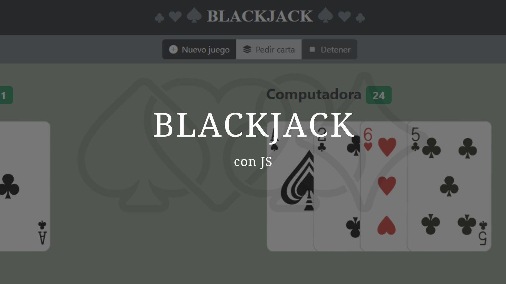

# Blackjack - Proyecto JS

Este proyecto es un juego de **Blackjack** desarrollado con **JavaScript**, **HTML**, y **CSS**. Es una versión básica del popular juego de cartas en el que puedes jugar contra la computadora. ¡Intenta conseguir 21 sin pasarte!

## Características del Proyecto  
1. Juego para un solo jugador contra la computadora.
2. Baraja estándar de 52 cartas.
3. Interfaz interactiva para pedir cartas, plantarse, y reiniciar el juego.

## Requisitos Previos  
- Un navegador moderno con soporte para JavaScript.
- No se necesita instalación de dependencias adicionales.
